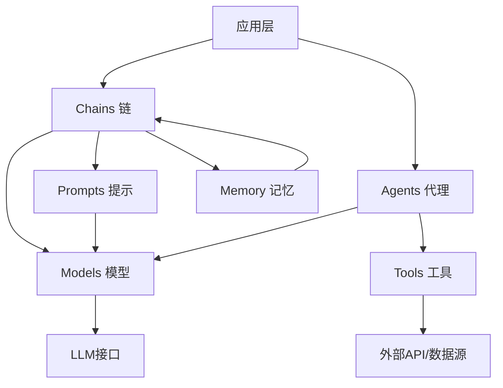

# 第1章：LangChain简介

## 1. 什么是LangChain

LangChain是一个开源框架，专门用于构建基于大型语言模型（LLM）的应用程序。它由Harrison Chase于2022年10月创建，旨在简化LLM应用的开发流程。

<aside>
💡 **核心定位：**LangChain让开发者能够轻松地将语言模型与外部数据源、API和工具连接起来，创建更强大、更实用的AI应用。

</aside>

### LangChain的主要特点

- **模块化设计：**提供可复用的组件，便于快速构建复杂应用
- **链式调用：**支持将多个组件串联，形成完整的处理流程
- **多模型支持：**兼容OpenAI、Anthropic、HuggingFace等多种LLM提供商
- **丰富的集成：**内置数百种工具和数据源的集成
- **记忆管理：**提供对话历史和上下文管理功能

---

## LangChain的核心概念和架构

LangChain的架构围绕几个核心概念构建，这些概念相互配合，形成了一个完整的开发生态系统。

### 核心组件架构图



### 1. Models（模型）

模型层是LangChain与各种语言模型交互的接口。

- **LLMs：**大型语言模型，接收文本输入并生成文本输出
- **Chat Models：**对话模型，专门用于多轮对话场景
- **Text Embedding Models：**文本嵌入模型，将文本转换为向量表示

### 2. Prompts（提示模板）

提示模板帮助标准化和优化与模型的交互方式。

- **Prompt Templates：**可复用的提示词模板
- **Example Selectors：**动态选择示例的机制
- **Output Parsers：**解析和结构化模型输出

### 3. Chains（链）

链是LangChain的核心概念，用于组合多个组件形成完整的工作流。

- **LLMChain：**最基础的链，组合模型和提示模板
- **Sequential Chains：**按顺序执行多个步骤
- **Router Chains：**根据条件动态选择执行路径

### 4. Memory（记忆）

记忆系统用于在对话或处理过程中保持状态和上下文。

- **ConversationBufferMemory：**存储完整的对话历史
- **ConversationSummaryMemory：**对历史对话进行摘要
- **VectorStoreMemory：**基于向量存储的语义记忆

### 5. Agents（代理）

代理能够根据用户输入自主决定使用哪些工具来完成任务。

- **Action Agents：**决定下一步执行什么动作
- **Plan-and-Execute Agents：**先制定计划，再逐步执行

### 6. Tools（工具）

工具是代理可以调用的外部功能接口。

- **搜索工具：**Google搜索、Wikipedia等
- **计算工具：**计算器、代码执行器等
- **数据库工具：**SQL查询、向量数据库等

---

## LangChain的应用场景

LangChain凭借其灵活的架构和丰富的功能，可以应用于众多实际场景。

### 📝 文档问答系统

基于企业内部文档构建智能问答系统，员工可以通过自然语言查询获取所需信息。

- **技术要点：**文档加载、文本分割、向量嵌入、相似度检索
- **典型应用：**企业知识库、技术文档助手、法律文件查询

### 💬 智能对话机器人

创建具有上下文理解和记忆能力的对话系统。

- **技术要点：**对话记忆管理、多轮对话处理、个性化回复
- **典型应用：**客户服务、虚拟助手、教育辅导

### 🔍 智能搜索与推荐

结合语义理解和外部数据源，提供更精准的搜索和推荐服务。

- **技术要点：**语义搜索、内容理解、个性化推荐
- **典型应用：**电商产品推荐、内容发现平台、学术文献检索

### ⚙️ 自动化工作流

通过Agent自动执行复杂的多步骤任务。

- **技术要点：**任务规划、工具调用、结果整合
- **典型应用：**数据分析自动化、报告生成、API集成

### 📊 数据分析助手

用自然语言与数据库交互，自动生成分析报告。

- **技术要点：**SQL生成、数据可视化、结果解释
- **典型应用：**商业智能、数据探索、报表生成

### ✍️ 内容创作辅助

辅助进行各类内容的创作和优化。

- **技术要点：**创意生成、内容优化、风格转换
- **典型应用：**营销文案、技术写作、创意设计

<aside>
🎯 **选择建议：**根据具体需求选择合适的LangChain组件。简单的问答场景可以使用基础的Chain，而复杂的任务自动化则需要Agent和Tools的配合。

</aside>

---

## 开发环境搭建

在开始使用LangChain之前，需要正确配置开发环境。以下是详细的搭建步骤。

### 前置要求

- **Python版本：**Python 3.8 或更高版本
- **包管理器：**pip 或 conda
- **代码编辑器：**推荐使用 VS Code、PyCharm 或 Jupyter Notebook

### 步骤1：创建Python虚拟环境

使用虚拟环境可以避免包版本冲突。

```bash
# 使用 venv 创建虚拟环境
python -m venv langchain-env

# 激活虚拟环境
# Windows
langchain-env\Scripts\activate
# macOS/Linux
source langchain-env/bin/activate
```

### 步骤2：安装LangChain

安装LangChain核心包和常用的集成包。

```bash
# 安装核心包
pip install langchain

# 安装OpenAI集成
pip install langchain-openai

# 安装社区集成包
pip install langchain-community

# 安装实验性功能
pip install langchain-experimental
```

### 步骤3：安装其他依赖

根据具体应用场景安装额外的依赖包。

```bash
# 向量数据库（选择其一）
pip install chromadb  # Chroma
pip install faiss-cpu  # FAISS

# 文档加载器
pip install pypdf  # PDF文档
pip install docx2txt  # Word文档
pip install beautifulsoup4  # 网页内容

# 其他工具
pip install python-dotenv  # 环境变量管理
pip install tiktoken  # Token计数
```

### 步骤4：配置API密钥

创建 `.env` 文件来安全地管理API密钥。

```bash
# .env 文件内容
OPENAI_API_KEY=your-openai-api-key-here
ANTHROPIC_API_KEY=your-anthropic-api-key-here
GOOGLE_API_KEY=your-google-api-key-here
```

### 步骤5：验证安装

创建一个简单的测试脚本来验证环境配置是否正确。

```python
from langchain_openai import ChatOpenAI
from langchain_core.messages import HumanMessage
from dotenv import load_dotenv

# 加载环境变量
load_dotenv()

# 初始化模型
llm = ChatOpenAI(model="gpt-3.5-turbo")

# 测试调用
messages = [HumanMessage(content="你好，LangChain！")]
response = llm.invoke(messages)

print(response.content)
```

### 常用开发工具推荐

| **工具类型** | **推荐工具** | **说明** |
| --- | --- | --- |
| IDE | VS Code | 轻量级，插件丰富 |
| IDE | PyCharm | 功能强大，适合大型项目 |
| 交互式开发 | Jupyter Notebook | 适合实验和原型开发 |
| 调试工具 | LangSmith | LangChain官方调试平台 |
| 版本控制 | Git | 代码版本管理 |

### 环境配置检查清单

- [ ]  Python 3.8+ 已安装
- [ ]  虚拟环境已创建并激活
- [ ]  LangChain核心包已安装
- [ ]  必要的集成包已安装
- [ ]  API密钥已配置
- [ ]  测试脚本运行成功

<aside>
⚠️ **注意事项：**建议定期更新LangChain及其依赖包，因为这是一个快速发展的项目。使用 `pip install --upgrade langchain` 来更新到最新版本。

</aside>

<aside>
💡 **学习建议：**环境搭建完成后，建议先阅读LangChain官方文档的快速入门指南，通过几个简单示例熟悉基本用法，然后再深入学习各个组件的高级特性。

</aside>